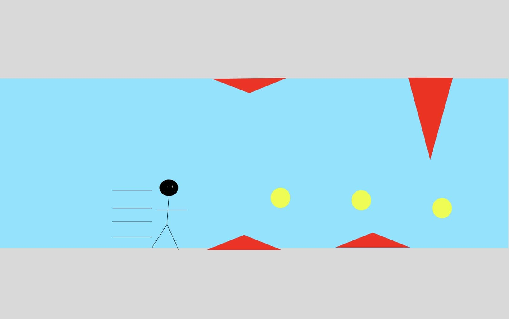
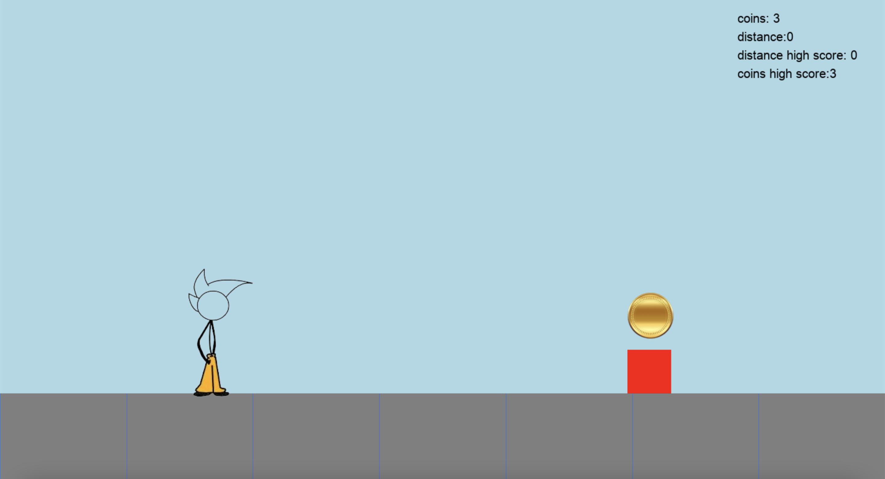

#  Coin Runner 
## CS110 Final Project Fall Semester, 2024

## Team Members

Amitai Saiger

***

## Project Description

An endless runner sidescroller with obstacles to avoid, coins to collect, and upgrades to make your character stronger after they die for future runs

## Requirements
pygame
pygame widgets
***    

## GUI Design

### Initial Design

### Final Design

## Program Design

### Features

1. Controllable Character
2. Obstacle Collisions
3. Menu Screen
4. Side Scrolling GUI
5. Coins To Collect
6. Upgrade to Buy
7. High Score Files

### Classes

- Obstacle: This class controls the coins and the obstacles becuase they have similar properties
- Runner: This class controls the runner that you play as
- Ground: This class controls the ground, which is made up of a spritegroup of blocks from this class
- Text: This class controls all the text used in the game

## ATP

Test Case 1: Opening the Game
- Test Description: Verify that the game can be opened with no errors.
- Test Steps:
    1. Ensure all required python libraries have been installed
    2. Open the terminal
    3. Navigate the the template_final_project-master folder in the github repo using the terminal (cd template_final_project-master)
    4. Run the main.py file through the terminal (python3 main.py) for mac or (python main.py) for windows
    5. Verify that the game opens with no errors
- Expected Outcome: The game should open with no errors.

Test Case 2: Starting to Play
- Test Description: Verify that upon clicking the start button, the application switches from the menu screen to the game screen.
- Test Steps:
    1. Open the game
    2. Click the top middle button that reads "click to start"
    3. Verify that the screen switches from the menu to the game
- Expected Outcome: The application should switch from displaying the menu screen to displaying the game screen, which looks like the final_gui.png picture in the assets folder.

Test Case 3: Jumping
- Test Description: Verify that the runner jumps correctly when you hit the space bar and lands on the ground.
- Test Steps:
    1. Open the game
    2. Click the start button
    3. Hit the space bar when the runner is on the ground
    4. Verify that the runner jumps and lands on the ground
    5. Hit the space bar
    6. Hit the space bar a second time while the runner is in the air
    7. Verify that the runner does not jump while mid air
- Expected Outcome: The Runner should jump when you hit the space bar, and land on the ground. The Runner should not be able to jump when they are not on the ground.

Test Case 4: Obstacle Collision
- Test Description: Verify that the runner collides correctly with obstacles (red boxes) and that the game screen closes when the runner hits an obstacle.
- Test Steps:
    1. Open the game
    2. Click the start button
    3. Allow the runner to collide with an obstacle by not jumping over it
    4. Verify that the screen goes from the game screen back to the menu screen
- Expected Outcome: Upon the runner colliding with an obstacle, the screen should go from the game screen to the menu screen.

Test Case 5: Collecting Coins
- Test Description: Verify that the runner collides correctly with coins (yellow circles) and the the coin counter goes up when the runner collides with coins.
- Test Steps:
    1. Open the game
    2. Click the start button
    3. Using the space bar, make the runner jump into a coin
    4. Verify that upon colliding with the coin, the coin dissapears and the coin counter goes up
- Expected Outcome: Upon the runner colliding the a coin, the coin should dissapear (and a new coin should soon appear on the right of the screen), and the coin counter should go up.

Test Case 6: High Score Files
- Test Description: Verify that the game stores high score data for max coins and max distance in the assets/coins_high_score.txt and assets/distance_high_score.txt files respectively in order to save high scores after closing the game.
- Test Steps:
    1. (Optional) Open Both high score txt files in the assets folder, and manually set the text inside them to 0 if they don't already have that text. Then save those files. This will make it easier to test this test case, but is not necessary
    2. Open the game
    3. Click the start button
    4. Collect more coins than collected previously since the game has been opened, and travel a farther distance than has previously been traveled since the game has been opened by using the space bar to jump over obstacles and collect coins
    5. Verify that the coin high score and distance high score values in the top right corner of the screen display the correct scores
    6. Close the game
    7. Open the game
    8. Verify that the high score values stay the same even though the game has been opened and closed
- Expected Outcome: The high score values should display correctly in game, and the data should persist even after closing and reopening the game.

## Optional Test Cases (These features require playing the game in order to collect coins for some amount of time before they can be tested)

Test Case 7: Distance Based Coin Multiplyer
- Test Description: Verify that the "coin multiplier" which multiplies the value of each coin goes up by 1x for every 10 distance travelled.
- Test Steps:
    1. Open the game
    2. Click the start button
    3. Travel at least 10 but not more than 20 distance by using the space bar to jump over obstacles
    4. Verify that upon the runner colliding with a coin after 10 but not more than 20 distance has been travelled, the coin counter goes up by 2 instead of 1
    5. (Optional) Repeat steps 2-4 with increasing distance values and verify that the value of a coin increases with every 10 distance travelled
- Expected Outcome: For every 10 distance travelled, the coin multiplier value should go up by 1x, increasing the amount a coin is worth by 1

Test Case 8: Coin Multiplyer Buttons
- Test Description: Verify that the coin multiplyer buttons allow you to purchase coin multiplyers if you have enough coins, and that they charge you the correct amount of coins
- Test Steps:
    1. Open the game
    2. Click on the button on the left reading "purchase 2x coin multiplier (costs 20 coins)"
    3. Verify that the button reverts to its original color after the mouse is released, and that nothing else happens
    4. Click the start button
    5. Collect at least 20 coins (this can be over multiple runs)
    6. Click on the button on the left reading "purchase 2x coin multiplier (costs 20 coins)" again
    7. Verify that the button on the left turns grey, and that your coins go down by 20
    8. Click the start button
    9. Verify that coins are now worth 2 coins for each coin the runner collides with
    10. (Optional) Repeat steps 2-9 with the 10x multiplier button on the right, collecting 200 coins and verifying that the button makes each coin worth 10 times as much (20, if the 2x multiplier has already been purchased)
- Expected Outcoome: The coin multiplier buttons should multiply the value of a coin by 2x and 10x respectively, but only if you have enough coins to purchase the upgrade. Your coins should go down by the amount that the button says the upgrade costs.

Test Case 9: Extra Lives
- Test Description: Verify that the extra lives button works correctly, and that extra lives allow you to keep playing upon collision with an obstacle.
- Test Steps: 
    1. Open the game
    2. Click on the button in the bottom middle reading "Click To Purchase an extra starting life (costs 100 coins)"
    3. Verify that the button reverts to its original color after the mouse is released, and that nothing else happens
    4. Click the start button
    5. Collect at least 100 coins (this may be easier if you make use of the coin multiplyer buttons)
    6. Click on the button in the bottom middle reading "Click To Purchase an extra starting life (costs 100 coins)"
    7. Verify that a lives counter appears in the top left of the screen showing that you now have 2 lives
    8. Click the start button
    9. Allow the runner to collide with an obstacle
    10. Verify that upon said collision, rather than returning to the menu screen, the lives counter goes down by one and the obstacle returns to the right of the screen
    11. Allow the runner to collide with a second obstacle
    12. Verify that the game returns to the menu screen, and that your lives are reset to your starting lives as controlled by how many times you have bought an extra starting life
    13. (Optional) Repeat steps 4-12 with extra lives (more than 2) and observe that the game allows you to keep playing until you run out of lives, at which point it returns to the menu screen
- Expected Outcome: The lives button should reveal a lives counter that accurately displays the amount of lives you have, and upon the runner colliding with an obstacle, you should be able to continue playing as long as you have lives remaining. Upon running out of lives, the game should return to the menu screen and your starting lives should be reset.